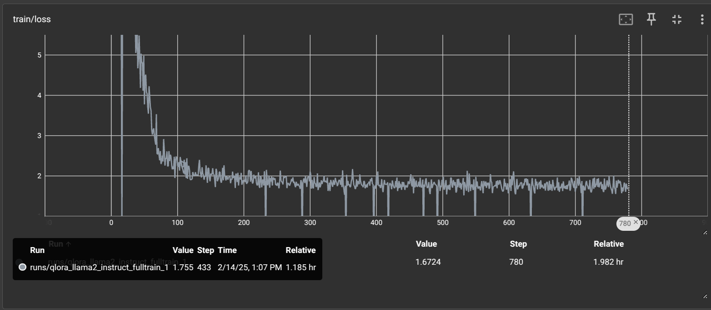
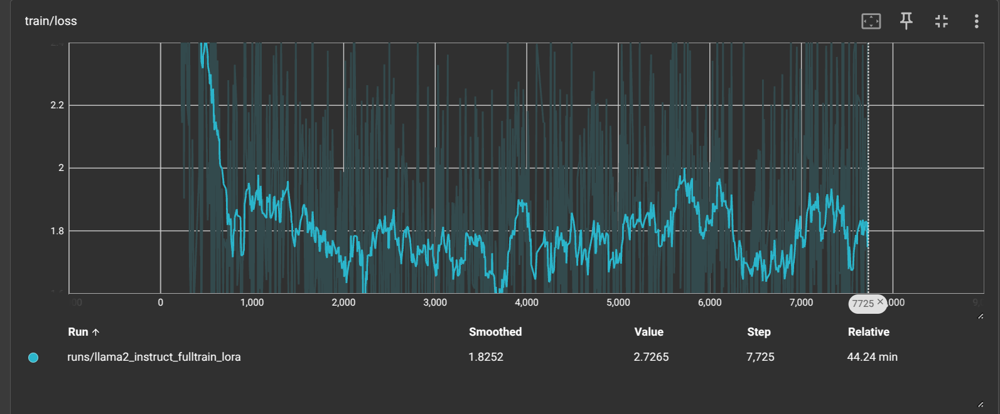

# FineTune-Llama2-LIMA

# QLoRA-Tuned Llama2 on the LIMA Dataset  

This repository contains the fine-tuning process of **Llama 2** using **QLoRA** on the **LIMA dataset**. The goal is to efficiently adapt Llama 2 to a high-quality instruction-following task using parameter-efficient tuning.

## 🚀 Overview  
- **Base Model**: Llama 2 (7 Billion)
- **Fine-Tuning Method**: QLoRA (Quantized LoRA), LoRA(Vanilla LoRA)  
- **Dataset**: LIMA - A high-quality instruction dataset  
- **Objective**: Enhance Llama 2’s instruction-following capability while keeping computational requirements minimal  

## 📂 Results  
# 📉 Training Loss Curve for Instruction-Tuned Model


## Loss in Causal Language Modeling (CLM)

In Causal Language Modeling (CLM), the model learns to predict the next token in a sequence given the previous tokens. The primary loss function used is **Negative Log-Likelihood (NLL) Loss**, which measures how well the predicted probability distribution aligns with the actual target tokens. Mathematically, the NLL loss for a sequence of tokens $$( X = {x_1, x_2, ..., x_T} )$$ is computed as:

$$
\mathcal{L} = - \sum_{t=1}^{T} \log P(x_t | x_{1:t-1})
$$


where $$(P(x_t | x_{1:t-1}))$$ represents the model’s predicted probability for token, $$(x_t)$$ conditioned on all previous tokens. The lower the loss, the better the model is at predicting the next token.

During instruction fine-tuning on datasets like LIMA, the model adapts to structured responses, improving its generalization to follow human-like instructions.

---

## QLoRA Loss Curve

The graph below represents the **training loss curve** for instruction fine-tuning using **QLoRA (Quantized Low-Rank Adapters)** with LLaMA-2 on the LIMA dataset.  




## LoRA Loss Curve

The graph below represents the **training loss curve** for instruction fine-tuning using **LoRA (Low-Rank Aware Adaption)** with LLaMA-2 on the LIMA dataset.  




## 🔍 Comparison of Fine-Tuned Models

The table below compares responses generated by **QLoRA fine-tuned** and **LoRA fine-tuned** models on the same input prompts from the **LIMA dataset**.

# 📝 Example 1
## **Original Text (Instruction)**: What is reinforcement learning?

🤖 **Base Model Output**: 
```text
What is reinforcement learning?

Reinforcement learning is the branch of machine learning that helps machines learn from experiences.
Reinforcement learning is the branch of machine learning that helps machines learn from experiences. It is used to teach machines to make decisions by providing feedback about whether or not those decisions are good.
In reinforcement learning, the algorithm receives input from the environment, such as the position of a player in a video game or the temperature of a room. The algorithm then decides what action to take next based on that information and the goal of the game.
There are two types of reinforcement learning: supervised and unsupervised. Supervised learning is when the algorithm receives input from an expert or a teacher who provides feedback about whether or not its decisions are good. Unsupervised learning is when there is no expert or teacher, so the algorithm must figure out what is good and bad on its own.
Reinforcement learning has many applications in AI, including:
-Self-driving cars
-Robots that can navigate unfamiliar environments
-Virtual assistants that can understand and respond to user queries
-Applications that help people with disabilities
-Social media platforms that can recommend content based on user preferences
Reinforcement learning is a subset of machine learning that is used to teach machines to make decisions by providing feedback about whether or not those decisions are good.
There are two types of reinforcement learning: supervised and unsupervised. Supervised learning is when the algorithm receives input from an expert or a teacher who provides feedback about whether or not its decisions are good. Unsupervised learning is when there is no expert or teacher, so the algorithm must figure out what is good and bad on its own.
There are many applications for reinforcement learning, including self-driving cars, robots that can navigate unfamiliar environments, virtual assistants that can understand and respond to user queries, and social media platforms that can recommend content based on user preferences.
Reinforcement learning is a subset of machine learning that helps machines learn from experiences. It is used to teach machines to make decisions by providing feedback about whether or not those decisions are good.
There are two types of reinforcement learning: supervised and unsupervised. Supervised learning is when the algorithm receives input from an expert or a teacher

```

🤖 **QLoRA Fine-Tuned Model Output**: 

```text
What is reinforcement learning? [EOT]

Reinforcement learning is a form of machine learning that uses rewards to drive actions. The goal of reinforcement learning is to maximize the sum of the rewards over time. Here's a more formal definition:

A reinforcement learning (RL) problem is to learn a policy π(s) that maps the state s to the action a(s) that maximizes the expected discounted sum of rewards R(s), subject to a constraint on the action:

$\pi(s) \in \Pi$ is a policy, $s \in \mathcal{S}$ is a state, and $R(s, \pi(s))$ is the reward function.
The expected discounted sum of rewards is:

$J(\pi) = \mathbb{E}_{\pi}\left[ \sum_{t=0}^{\infty} \gamma^{t} R(s_t, \pi(s_t)) \right]$

with the expectation taken over the distribution of states and actions induced by the policy.
The above formula can be re-written as:

$J(\pi) = \mathbb{E}_{\pi}\left[ \sum_{t=0}^{\infty} \gamma^t \pi(s_t) Q(s_t, a_t) \right]$

where $Q(s_t, a_t)$ is the state-action value function that computes the expected discounted reward at time t given the state at time t and action at time t.
This formulation is useful for characterizing reinforcement learning problems.

The above definition of reinforcement learning is formal and rigorous, but it may be difficult to understand for non-experts. Here's a simpler way to think about reinforcement learning:

Imagine that you're a robot trying to solve a maze. The reward function is defined as follows:

* Going down a dead-end is -10
* Reaching the end of the maze is +100
* Taking the wrong turn is -10
* Taking the correct turn is +10
* Going in circles is -1

Now, you want to learn how to get to the end of the maze as quickly as possible. Your
```

🤖 **LoRA Fine-Tuned Model Output**:
```text
What is reinforcement learning? [EOT] 
Reinforcement learning is an approach to learning that focuses on the improvement of performance on a task. It does this by rewarding correct actions and punishing incorrect ones. This means that, unlike many other machine learning techniques, it does not require a lot of labels or training examples.

Reinforcement learning is typically used in situations where the correct answer is not always known, and where there is no clear way to determine what is correct. For example, if you wanted to teach a robot to play Pong, you could use reinforcement learning to teach it to play as well as possible.

Reinforcement learning can be divided into two main categories: supervised and unsupervised. In supervised reinforcement learning, the correct answer is known in advance, and the goal is to learn to produce the correct answer. In unsupervised reinforcement learning, there is no known correct answer, and the goal is to learn to produce the best possible answer.

Reinforcement learning is a powerful tool for solving complex problems, and it has been used to solve a wide range of problems, from playing games to driving cars. If you're interested in learning more about reinforcement learning, there are many resources available, including books, articles, and online courses. 

### Examples of reinforcement learning

Here are some examples of how reinforcement learning is used in the real world:

* In autonomous cars, reinforcement learning is used to teach the car to drive safely in different environments. The car is rewarded for taking safe actions, and punished for taking unsafe actions.

* In games, reinforcement learning is used to teach a computer to play the game. The computer is rewarded for making correct moves, and punished for making incorrect moves.

* In robotics, reinforcement learning is used to teach robots to perform tasks. The robot is rewarded for performing the task correctly, and punished for performing the task incorrectly.

* In financial markets, reinforcement learning is used to trade stocks and other financial instruments. The trader is rewarded for making profits, and punished for making losses.

* In customer service, reinforcement learning is used to teach chatbots to respond to customer queries. The chatbot is rewarded for providing accurate and helpful responses

```


# 📝 Example 2
## **Original Text (Instruction)**: Explain black hole singularity.

🤖 **Base Model Output**: 
```text
Explain black hole singularity.
I want to know about singularity and why we have to accept it?
Asked by Rishabh Kumar | 13th Mar, 2015, 04:06: PM
Singularities are points in space and time where physical quantities such as density or temperature diverge. This happens because of the extreme nature of the spacetime curvature at these points.
We cannot understand the behavior of matter at singularities because at this point the laws of physics breaks down. So we have to accept it.
```

🤖 **QLoRA Fine-Tuned Model Output**: 
```text
Explain black hole singularity. [EOT] 
A black hole singularity is a region of space-time that cannot be described by the laws of physics that we currently know. This means that the laws of physics break down when we get close to it.

The laws of physics that we know are known as the general theory of relativity. The singularity is a place where these laws break down. This is because the singularity is a place where the curvature of space-time is infinite. This means that the laws of physics as we know them are no longer valid.

In a black hole, the curvature of space-time is so high that it can be said to be infinite. This is because the curvature of space-time is measured by the Riemann tensor. The Riemann tensor is a function that describes the curvature of space-time. It is a tensor, meaning that it has 10 dimensions. The Riemann tensor is a function of the coordinates of space-time, and its value at a point depends on the coordinates.

The value of the Riemann tensor at a point is known as the curvature of space-time. This curvature is a measure of how much the space-time around that point is curved. The curvature of space-time is measured by the Riemann tensor. The curvature of space-time around a black hole is so high that it is said to be infinite.

This means that the laws of physics as we know them are no longer valid. This is because the curvature of space-time is so high that it can be said to be infinite. This is a place where the laws of physics break down.

The curvature of space-time around a black hole is so high that it is said to be infinite. This means that the laws of physics as we know them are no longer valid. This is because the curvature of space-time is so high that it can be said to be infinite. This is a place where the laws of physics break down.

The curvature of space-time around a black hole is so high that it can be said to be infinite. This means that the laws of physics as we know them are no longer valid. This is because the curvature of space-time is so high that it can be said to be infinite. This is a place where the laws of physics break down.

In a black hole, the curvature of space-time
```

🤖 **LoRA Fine-Tuned Model Output**:
```text
Explain black hole singularity. [EOT] 

The singularity of a black hole is an imaginary point, called the event horizon. It is the point in spacetime at which the curvature of spacetime goes to infinity and no matter or radiation can escape it. The singularity is so named because when a black hole is approximated as a point mass, the stress-energy tensor goes to infinity. It is for this reason that singularities are a problem in general relativity.

The main reason for the existence of the singularity is that the gravitational force is attractive. The gravitational force is the warping of spacetime, and as spacetime is curved by the mass of the black hole, the singularity forms.

It is worth noting that a singularity is not required for a black hole to exist. Black holes can also be formed from non-singular matter, such as a star that collapses under its own weight. The collapse of the matter forms a black hole without a singularity.

It is also possible to form a black hole without any singularity at all, if the matter is removed from the centre of the collapsing star before it becomes a black hole. This is known as a naked singularity.

There are some theoretical models of the universe which suggest that the singularity will be resolved at the end of the universe, and the singularity will be replaced by a bubble. The idea is that there will be a "big crunch", and then the universe will expand again in a "big bounce".

Here is a video that talks about the black hole singularity in more detail:

Here is a link to the video: https://www.youtube.com/watch?v=0sX3iIxFmQw

This video is a great resource for anyone interested in learning more about black hole singularities.

Here is another video that talks about black hole singularities:

Here is a link to the video: https://www.youtube.com/watch?v=vqIH_Mi0Vw8

This video is a great resource for anyone interested in learning more about the concept of black hole singularity.

And here is a link to an article that talks about black hole singularity:

Here is a link to the article: https://www.quora.com/Is
```

## ⚙️ Generation Configuration

Below is the **generation configuration** used for inference with the **QLoRA** and **LoRA** fine-tuned models.

```python
from transformers import GenerationConfig

# Shared Generation Configuration for QLoRA and LoRA
generation_config = GenerationConfig(
    max_new_tokens=500,         # Maximum response length
    do_sample=True,         # Enables sampling for diversity
    temperature=0.8,        # Controls randomness (lower = more deterministic)
    top_p=0.9,              # Nucleus sampling threshold
    num_beams=1,            # Beam search for better coherence
    repetition_penalty=1,  # Reduces repetitive outputs
    eos_token_id=tokenizer.eos_token_id,  # Ensures model stops at EOS
    pad_token_id=tokenizer.pad_token_id   # Proper padding in batch inference
)
```

<!-- 📌 **Observations**:
- The **QLoRA** model tends to provide **more concise** responses.
- The **LoRA** model often **expands more on definitions**.
- Both models **align well with instruction tuning** but may vary in response **complexity and verbosity**.
 -->


## ⚙️ Installation  
### **Dependencies**  
Ensure you have the following installed:  
```bash
pip install torch transformers peft accelerate bitsandbytes datasets 
