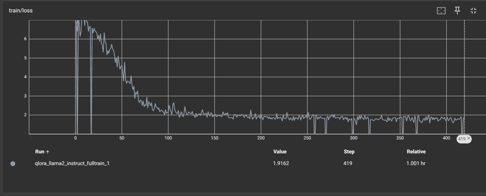

# FineTune-Llama2-LIMA

# QLoRA-Tuned Llama2 on the LIMA Dataset  

This repository contains the fine-tuning process of **Llama 2** using **QLoRA** on the **LIMA dataset**. The goal is to efficiently adapt Llama 2 to a high-quality instruction-following task using parameter-efficient tuning.

## 🚀 Overview  
- **Base Model**: Llama 2 (7B/13B/Other)  
- **Fine-Tuning Method**: QLoRA (Quantized LoRA)  
- **Dataset**: LIMA - A high-quality instruction dataset  
- **Objective**: Enhance Llama 2’s instruction-following capability while keeping computational requirements minimal  

## 📂 Results  
# 📉 Training Loss Curve for Instruction-Tuned Model



The graph below represents the training loss curve for instruction fine-tuning on the LIMA dataset using a causal language modeling (CLM) objective.

During training, the model optimizes the negative log-likelihood (NLL) loss, predicting the next token given previous tokens. As expected, the loss decreases over epochs, indicating that the model is learning from the instruction-tuned dataset.

A smooth decline suggests effective convergence.
Any plateaus or fluctuations could indicate underfitting, overfitting, or the need for hyperparameter tuning (e.g., batch size, learning rate).
Final loss values provide insight into model readiness for evaluation and inference.
This loss curve validates the fine-tuning process and ensures the model has successfully adapted to instruction-following tasks.

<!-- ## 🔍 Comparison of Fine-Tuned Models

The table below compares responses generated by **QLoRA fine-tuned** and **LoRA fine-tuned** models on the same input prompts from the **LIMA dataset**.

| 📝 **Original Text (Instruction)** | 🤖 **QLoRA Fine-Tuned Model Output** | 🤖 **LoRA Fine-Tuned Model Output** |
|------------------------------------|--------------------------------------|--------------------------------------|
| What is reinforcement learning?   | RL is a machine learning approach where agents learn by interacting with an environment. | Reinforcement learning involves training agents to make sequential decisions by rewarding desirable behaviors. |
| Explain black hole singularity.   | A black hole singularity is a point where gravity is infinite and spacetime curvature becomes undefined. | The singularity of a black hole is a theoretical point of infinite density where the laws of physics break down. |
| Describe the role of mitochondria. | Mitochondria are organelles responsible for energy production in cells, often called the powerhouse of the cell. | The mitochondrion generates ATP through oxidative phosphorylation, providing energy for cellular processes. | -->

## ⚙️ Generation Configuration

Below is the **generation configuration** used for inference with the **QLoRA** and **LoRA** fine-tuned models.

```python
from transformers import GenerationConfig

# Shared Generation Configuration for QLoRA and LoRA
generation_config = GenerationConfig(
    max_length=500,         # Maximum response length
    do_sample=True,         # Enables sampling for diversity
    temperature=0.7,        # Controls randomness (lower = more deterministic)
    top_p=0.8,              # Nucleus sampling threshold
    num_beams=1,            # Beam search for better coherence
    repetition_penalty=1.2,  # Reduces repetitive outputs
    eos_token_id=tokenizer.eos_token_id,  # Ensures model stops at EOS
    pad_token_id=tokenizer.pad_token_id   # Proper padding in batch inference
)
```

📌 **Observations**:
- The **QLoRA** model tends to provide **more concise** responses.
- The **LoRA** model often **expands more on definitions**.
- Both models **align well with instruction tuning** but may vary in response **complexity and verbosity**.


## ⚙️ Installation  
### **Dependencies**  
Ensure you have the following installed:  
```bash
pip install torch transformers peft accelerate bitsandbytes datasets 
